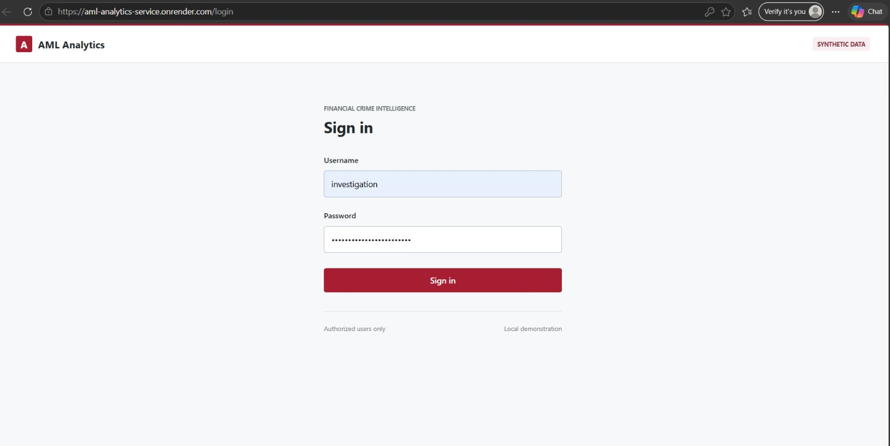
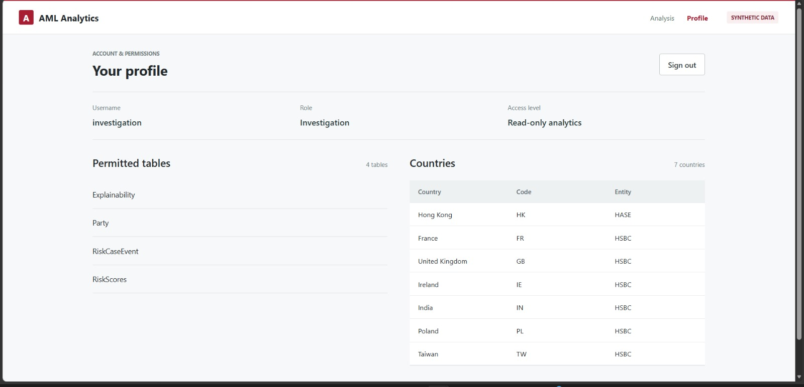
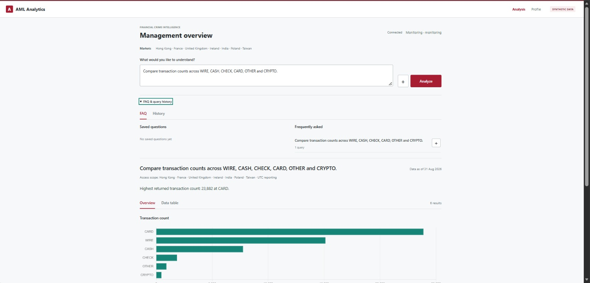
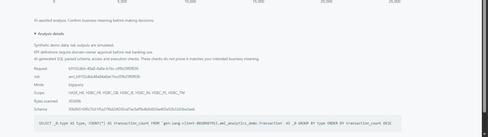
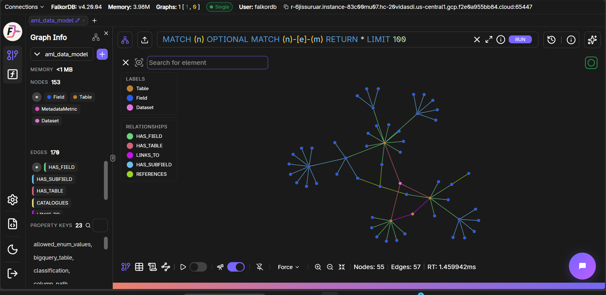

# AML KPI Copilot

A text-to-SQL pipeline for AML (anti-money-laundering) KPI reporting: ask a question in plain English,
generate SQL grounded in the deployed schema, validate it independently, and query the synthetic BigQuery
dataset through a separate read-only analytics service. The original SQL-only endpoint remains available.

**Live application:** [aml-analytics-service.onrender.com/login](https://aml-analytics-service.onrender.com/login)
— see [Deployment](#deployment) below for what's actually running there and its caveats before relying on it.

### Walkthrough

Sign in with one of the three demo roles (`monitoring`, `investigation` or `admin`):



| Role | Permitted tables (via authorized BigQuery views) | Countries |
| --- | --- | --- |
| `monitoring` | Party, AccountPartyLink, Transaction, InteractionEvent, PartySupplementaryData, RetailPartiesRegistration, CommercialPartiesRegistration | All 7: Hong Kong, United Kingdom, India, Taiwan, France, Poland, Ireland |
| `investigation` | Party, RiskCaseEvent, RiskScores, Explainability | Same 7 |
| `admin` | Union of the two roles above (10 distinct tables); no administrative write permissions | Same 7 |

`RegisteredPartiesExport` and `ExportedMetadata` are excluded for every role, including Admin. Each role
authenticates as its own read-only BigQuery service account (`aml-monitoring-poc`, `aml-investigation-poc`,
`aml-admin-poc`) with Data Viewer access only on its permitted views — none has direct source-table access,
and a request cannot supply its own role or table scope. See
[`docs/ARCHITECTURE.md`'s "analytics_service in Detail"](docs/ARCHITECTURE.md#analytics_service-in-detail)
for the full access-control write-up.

`/profile` shows the signed-in identity's role, access level, and exactly which tables/countries it can see
— here, the `investigation` role is limited to Explainability, Party, RiskCaseEvent and RiskScores:



Ask a question in plain English on the Analysis page; it generates SQL, runs it against BigQuery, and
renders a chart plus a one-line summary:



Expanding "Analysis details" on any result shows the executed SQL, BigQuery job ID, bytes scanned, schema
version, and the access scope it ran under — nothing here is fabricated or estimated:



## Local live-data integration

Use [`docs/ARCHITECTURE.md`'s "analytics_service in Detail"](docs/ARCHITECTURE.md#analytics_service-in-detail)
for Ollama setup, Google login, approved read-only access provisioning and the free-form results dashboard.
The requested model is `mannix/defog-llama3-sqlcoder-8b`. No mock-data fallback is used by the live path.

See [`docs/TEST_REPORT.md`](docs/TEST_REPORT.md) for detailed evaluation results and known limitations,
and [Deployment](#deployment) below for the current public PoC instances.

## BigQuery demo dataset

The synthetic dataset is deployed at `gen-lang-client-0810987953.aml_demo`
in `asia-south1`: 1,000 retail customers, exactly 50,000 transactions, January-August 2026, 12 tables.
All people, accounts, events and outputs are fictional — nothing here is a real SAR or real risk assessment.

- [Deployed dataset schema, enums and observed values](dataset/aml_data_model_schema.json)
- [Complete data package, including the migration baseline](dataset/releases/aml_dataset_v2_20260919.zip)
- [Cloud migration verification](dataset/reports/migration_cloud.json)
- [`docs/ARCHITECTURE.md`'s "Dataset Design and Limitations"](docs/ARCHITECTURE.md#dataset-design-and-limitations)
  for how the dataset was constructed, its scope/count decisions, and known schema limitations.

The enriched schema under `dataset/` documents the actual BigQuery data and is the metadata source
for local execution mode. The original `schema/` document remains available to the legacy model path.
All data and AML outputs in this package are simulated; querying cloud-hosted rows does not make them
real customer data or validated AML predictions.

**Entity-country identifiers (v2):** Hong Kong uses `HASE_HK`; the other six countries use `HSBC_GB`,
`HSBC_IN`, `HSBC_TW`, `HSBC_FR`, `HSBC_PL` and `HSBC_IE` (`GB` is the UK country code). Identifiers keep
their original numeric suffixes (`HASE_HK_P0001`, `HSBC_IN_A0003`, `HSBC_FR_T000125`); customer names use
`HASE_HK_CUSTOMER_0001` and source labels use `HASE_HK_CORE` (equivalent prefixes for the other countries).
Transaction IDs follow their account owner's country; cases and events follow their customer's country.
External counterparties use names like `External HK Counterparty 0001` — these do not imply bank affiliation.

**Reproducing and loading the dataset** (from `dataset/`, in authenticated Google Cloud Shell for the load
step):
```sh
python3 generate.py                    # reproduces the package with fixed seed 20260919
python3 load_bigquery.py --plan        # validates file checksums, shows the load target
python3 load_bigquery.py               # loads via the current gcloud identity; WRITE_EMPTY, stable job IDs,
                                        # refuses to overwrite/append to unrecognized tables, resumable
python3 enrich_schema.py               # refreshes aml_data_model_schema.json's observed-value metadata
                                        # from local data only, without touching BigQuery or records
python3 check_naming.py                # verifies the identifier mapping against baseline files
```
`data/`: newline-delimited JSON, one file per table. `schemas/`: explicit nested BigQuery schemas (no
autodetection). `companion/`: transaction original currency, fictional fixed FX rates, and scenario ground
truth — **not** loaded as extra AML tables. `reports/validation.json`: local validation result and expected
counts/totals. `reference/`: the unchanged originally-supplied schema, the official input schema snapshot,
and the original project KPI SQL.

To restore ignored data files from a fresh checkout, run from the repository root:

```sh
unzip -n dataset/releases/aml_dataset_v2_20260919.zip -d .
python3 -m unittest discover -s dataset -p 'test_*.py'
python3 dataset/check_naming.py
```

The archive includes source copies; `-n` preserves the current checked-in files.

---

## Deployment

Two Render services make up the current PoC deployment; there is no bundled frontend or Vercel deployment
anymore (an earlier `frontend/`/`vercel-frontend` chat UI was retired once `analytics_service` became the
real product surface — see git history if you need that code back).

| Service | Platform | What it is |
| --- | --- | --- |
| [`aml-analytics-service`](https://aml-analytics-service.onrender.com) | Render (free tier) | The deployed product: `analytics_service`'s role-based login, BigQuery-backed dashboard, and query history. Sign in at `/login`. |
| `aml-model-backend` | Render (free tier) | `app.py` alone — an internal-only `POST /generate-sql` API with no UI. `aml-analytics-service` calls it over HTTPS; nothing else should depend on it directly. |
| Ollama / SQLCoder | This laptop, via a self-healing Cloudflare quick tunnel | Both Render services reach `mannix/defog-llama3-sqlcoder-8b` through a `cloudflared` tunnel to Ollama running locally, not a cloud-hosted model. `ops/ollama_tunnel_watchdog.py` keeps it alive — see below. |

**This is deliberately not the governed architecture `docs/ARCHITECTURE.md` describes** (no Cloud Run, no
Secret Manager, no VPC-SC perimeter, no structured audit log) — it's the fastest path to a working public
demo, and it inherits every limitation that implies:

- **The Ollama tunnel is still a laptop dependency, but no longer a manual one.** Cloudflare's free "quick
  tunnels" are inherently ephemeral — the process can keep running while its edge connection silently
  drops, and every restart gets a brand-new random hostname, which used to mean redeploying
  `aml-model-backend` by hand each time it happened. `ops/ollama_tunnel_watchdog.py` now supervises this
  end to end: it health-checks the tunnel every 30s, restarts `cloudflared` when it fails, and — only when
  the public URL actually changes — pushes the new value to `aml-model-backend`'s `OLLAMA_HOST` via
  Render's REST API and triggers a fresh deploy of that service (a plain restart doesn't pick up a
  changed env var), fully automatically. Run it once and leave it running
  (`python ops/ollama_tunnel_watchdog.py`, needs `pip install -r ops/requirements.txt` and a Render API key
  — either `RENDER_API_KEY` in the environment, or the one `render login` already stored in
  `~/.render/cli.yaml`). What this *doesn't* fix: if the laptop itself sleeps, loses network entirely, or
  Ollama stops running, there's no tunnel to heal — see "Move Ollama off this laptop entirely" as the only
  way to remove that dependency completely.
- **`analytics_service` no longer serializes almost all traffic behind one query at a time.** Its `/query`
  endpoint is gated by a `BoundedSemaphore` (`max_concurrent_queries`), which used to default to 1 locally
  and 2 in prod — every simultaneous user beyond that got rejected outright with a 429 ("Query capacity is
  busy") rather than running concurrently, which is what made the whole app feel single-user and slow.
  Raised to 6 (cap 20) in `analytics_service/config.py`, `setup_local.py`, the local
  `config.roles.local.json`, and the deployed `aml-analytics-service`'s Render secret file. Separately,
  `pipeline/text2sql_falkordb.py` was opening a brand-new HTTP connection to Ollama and a brand-new
  FalkorDB connection on every single request instead of reusing one — pure fixed per-request latency with
  no benefit — so both now reuse a shared, thread-safe connection (`requests.Session`, a lazily-created
  graph singleton) across requests.
- **Ollama serves multiple requests concurrently, not one at a time.** By default Ollama processes one
  generate call at a time per model, which serialized every concurrent user behind whichever query
  happened to start first. `OLLAMA_NUM_PARALLEL=2` (and `OLLAMA_MAX_LOADED_MODELS=1`, to keep memory bounded
  on a 16GB laptop) is now set as a persistent Windows user environment variable, so two questions can
  generate SQL at the same time instead of queueing — verified by firing two `/generate-sql` calls at once
  and confirming they finish within seconds of each other instead of back-to-back. This only takes effect
  for an Ollama process launched *after* the env var was set: either `ollama serve` run directly, or the
  tray app (`ollama app.exe`) after a fresh login/reboot. Raising it further trades memory for more
  concurrency — each parallel slot needs its own KV cache sized by `OLLAMA_NUM_CTX` — so don't raise it
  without headroom to spare.
- **Free tier means cold starts and tight memory.** Each service spins down after inactivity and takes
  tens of seconds to cold-start on the next request. The two services were deliberately split into
  separate Render instances (rather than one instance running both processes) after the combined version
  was observed OOM-restarting mid-query — each now gets its own 512MB instead of sharing one.
- **BigQuery auth reuses a personal Google login's Application Default Credentials**, uploaded to Render
  as a secret file, rather than a dedicated service-account key scoped to just this deployment. Revoking
  it later means redoing that `gcloud auth application-default login` and re-uploading the credential.
- **Two local-only secret files never leave this laptop by design:** `analytics_service/config.roles.local.json`
  (uploaded to Render as a secret file, not committed) and `profile-logins.local.json` (plaintext
  reference passwords for the three demo logins — read by *you*, never by the running server; see
  [`docs/ARCHITECTURE.md`](docs/ARCHITECTURE.md#analytics_service-in-detail)).

Redeploying either Render service (after a code change, a new Cloudflare tunnel URL, etc.) is done via the
[Render CLI](https://render.com/docs/cli) rather than a `render.yaml` Blueprint import, since Render's
Blueprint flow only launches services from the dashboard, not headlessly. `render.yaml` in this repo
documents `aml-model-backend`'s configuration for reference/reproducibility; it isn't wired to auto-deploy
either service end-to-end.

## Architecture

```
question
   │
   ▼
retrieve relevant tables/fields  (FalkorDB knowledge graph — hybrid lexical + semantic search)
   │
   ▼
exemplar retrieval ──── (near-)duplicate of a verified KPI question? ──► return its gold SQL, skip generation
   │ no match
   ▼
serialize retrieved schema as CREATE TABLE DDL
   │
   ▼
mannix/defog-llama3-sqlcoder-8b  (local Ollama server, temperature 0 / deterministic)
system prompt: "AML analyst and business leader... strictly adhere to the schema"
   │
   ▼
schema-grounded repair  (fuzzy + semantic match hallucinated table/column names back onto
                          the tables retrieval actually knows are real for this question)
   │
   ▼
final validation gate  (schema_validator.py — re-checks against the full canonical schema
                         file, corrects enum-value casing, catches anything repair missed)
   │
   ▼
validated SQL + violation list, returned to the caller
```

**Why this shape:**
- **Knowledge-graph retrieval, not a hardcoded schema.** The AML data model has 12 tables and hundreds of
  fields; a fixed prompt schema would either omit relevant tables or bloat the model's input on every
  question. Retrieval blends lexical overlap (exact identifier/enum-value hits) with semantic similarity
  (so "customers" still finds `Party`, "SAR" still finds `RiskCaseEvent` via its `type` enum) and expands
  one hop across foreign keys so joinable tables aren't dropped. This "FalkorDB knowledge graph" is a real
  graph database (Redis-protocol, Cypher queries), not a relational schema dump — `Table`/`Field`/`Dataset`/
  `MetadataMetric` nodes connected by `HAS_FIELD`/`HAS_TABLE`/`HAS_SUBFIELD`/`REFERENCES`/`LINKS_TO`/
  `CATALOGUES` edges, queried directly by `pipeline/text2sql_falkordb.py`'s retrieval step:

  
- **SQLCoder, not a fine-tuned model.** `mannix/defog-llama3-sqlcoder-8b` runs locally via Ollama and
  needs no fine-tuning. It's instruction-following, so it actually attends to the system prompt's
  read-only/schema-adherence rules. Run deterministically (temperature 0, fixed seed) for reproducible
  query generation. This pipeline originally used a fine-tuned `gaussalgo/T5-LM-Large-text2sql-spider`
  checkpoint; that path (and all training/fine-tuning code) has been fully removed after switching to
  SQLCoder, which matched or beat it on every eval suite without any fine-tuning — see
  [`docs/TEST_REPORT.md` §0](docs/TEST_REPORT.md#0-pivot-fine-tuned-t5--sqlcoder-via-ollama) for the
  before/after numbers and full rationale.
- **Two independent repair passes.** KG-scoped repair (right after generation) has the retrieval step's
  own knowledge of which tables/columns are real for *this* question; the final validation gate re-checks
  against the *entire* canonical schema, so a correct table that fell outside retrieval's top-k selection
  can still be recovered, and anything the first pass missed gets a second, independent check.
- **Exemplar retrieval beats blind regeneration.** A fixed KPI chatbot sees the same handful of questions
  repeatedly; reusing a verified answer for a (near-)duplicate is safer than regenerating and risking a new
  hallucination every time. Novel questions still fall through to model generation.

## Project structure

```
.
├── app.py                    # FastAPI model-service API (entry point) — run with `uvicorn app:app`
│                              #   internal-only: no bundled frontend; deployed as aml-model-backend
├── render.yaml                # Render service definition reference for aml-model-backend
├── requirements.txt            # Root install target: -r analytics_service/requirements.txt + model-service deps
├── .env.example                # FalkorDB / Ollama / schema-backend env var template
├── pipeline/                  # Core text-to-SQL pipeline (importable package)
│   ├── text2sql_falkordb.py   #   retrieval + schema serialization + exemplar shortcut + inference
│   ├── schema_validator.py    #   final validation/repair against the canonical schema file
│   ├── bigquery_schema.py     #   schema adapter analytics_service reads (SCHEMA_BACKEND=auto|falkordb)
│   └── semantic_search.py     #   shared sentence-embedding helper used across retrieval/repair
├── graph/
│   └── build_falkordb_graph.py   # Loads schema/aml_data_model_schema.json into FalkorDB as a knowledge graph
├── schema/
│   ├── aml_data_model_schema.json  # Canonical AML input/output data model (legacy model path)
│   └── aml_kpi_queries.sql         # Hand-written reference KPI queries against that schema
├── dataset/                   # Deployed BigQuery dataset: schema/enum metadata, generator, loading/migration
│   └── aml_data_model_schema.json  #   deployed schema + observed-value metadata (analytics_service's source)
│                              #   dataset docs/loading are in the "BigQuery demo dataset" section above and
│                              #   docs/ARCHITECTURE.md's "Dataset Design and Limitations"
├── analytics_service/          # The actual deployed product: role-based auth, BigQuery execution, dashboard UI
│   ├── app.py                 #   FastAPI app (create_app factory) — mounted at /ui, deployed as aml-analytics-service
│   ├── local.py                #   local dev launcher (starts app.py + analytics_service.app together)
│   └── render_start.py         #   (unused by the current split deployment; see README §Deployment)
│                              #   role/login setup, IAM provisioning, session/history details are documented
│                              #   in docs/ARCHITECTURE.md's "analytics_service in Detail" section
├── eval/
│   ├── evaluate_text2sql.py   # Evaluation harness — runs the pipeline against a test file, scores it
│   ├── eval_testcases.json    #   exemplar bank (also used at runtime for exemplar retrieval)
│   ├── eval_heldout.json      #   held-out test set (paraphrases + novel questions)
│   ├── eval_new_queries.json  #   additional schema-strict test questions
│   └── *_results.json         #   evaluation output (regenerated by evaluate_text2sql.py)
└── docs/
    ├── TEST_REPORT.md          # Detailed test report: methodology, results, bugs found, limitations
    ├── ARCHITECTURE.md         # Target governed-architecture design + current PoC deployment notes
    └── reference/               # Design reference material (not part of the app)
```

## Setup

1. Copy `.env.example` to `.env` and fill in your FalkorDB connection details (see the file for the full
   set of variables, including `HF_TOKEN`, `SCHEMA_BACKEND`, and Ollama tuning knobs):
   ```
   FALKORDB_HOST=...
   FALKORDB_PORT=...
   FALKORDB_USERNAME=...
   FALKORDB_PASSWORD=...
   FALKORDB_GRAPH=aml_data_model
   OLLAMA_HOST=http://localhost:11434
   OLLAMA_MODEL=mannix/defog-llama3-sqlcoder-8b
   ```
2. Install dependencies:
   ```
   pip install -r requirements.txt
   ```
   (This also installs `analytics_service`'s own dependencies via `-r analytics_service/requirements.txt`.)
3. Install [Ollama](https://ollama.com) and pull the SQLCoder model (one-time, ~4.7 GB):
   ```
   ollama pull mannix/defog-llama3-sqlcoder-8b
   ```
   Ollama must be running (the desktop app, or `ollama serve`) whenever the pipeline generates SQL.
4. Load the schema into FalkorDB (one-time, or whenever `schema/aml_data_model_schema.json` changes):
   ```
   python graph/build_falkordb_graph.py
   ```
5. Authenticate to Google Cloud for BigQuery access (needed by `analytics_service`; not needed for the
   model-service API alone). Install the [Google Cloud CLI](https://cloud.google.com/sdk/docs/install),
   then sign in with the Google account authorized to impersonate the `aml-monitoring-poc` /
   `aml-investigation-poc` / `aml-admin-poc` service accounts in `gen-lang-client-0810987953`:
   ```
   gcloud auth application-default login
   gcloud auth application-default set-quota-project 1076784773678
   ```
   This writes Application Default Credentials that `analytics_service`'s BigQuery client picks up
   automatically via `google.auth.default()` — no key file or extra config needed locally. See
   [Deployment](#deployment) for how these same credentials get used (as a secret file) in the hosted
   instance, and its caveats.

## Running

**Full product, locally** (model service + role-based dashboard together): see
[`docs/ARCHITECTURE.md`'s "analytics_service in Detail"](docs/ARCHITECTURE.md#analytics_service-in-detail) —
`python -m analytics_service.local --port 8012` starts both and prints the login URL. This is the same pair
of processes as the deployed `aml-model-backend` / `aml-analytics-service` split, just running as one local
launcher.

**Model-service API alone** (from the project root):
```
uvicorn app:app --host 0.0.0.0 --port 8000
```
`POST /generate-sql` with `{"question": "..."}`. Interactive API docs at `/docs`. This service has no
frontend of its own.

**CLI** (one-off question, no server):
```
python pipeline/text2sql_falkordb.py --with-system-prompt "Show the top 10 parties by risk score"
```

**Evaluate the pipeline** against a test set:
```
python eval/evaluate_text2sql.py --testcases eval/eval_heldout.json --out results.json
```

## API reference

Both services' full HTTP contracts — every endpoint, request/response schema, auth scheme, and status
code — are documented as OpenAPI 3.0 specs and viewable as an interactive Swagger UI reference:

**[Browse the API docs](docs/api-reference.html)** (switch between the two services with the tabs at the
top) — a self-contained page with both specs embedded, so it renders standalone with no build step; open
it directly in a browser, or serve `docs/` and open it over HTTP.

The raw specs are also committed at [`docs/openapi-analytics-service.json`](docs/openapi-analytics-service.json)
(the public product's full surface: auth, `/query`, workspace, status/metrics) and
[`docs/openapi-model-service.json`](docs/openapi-model-service.json) (the internal `/generate-sql` API).
They're two separate documents rather than one merged spec because both services expose `GET /health`, and
OpenAPI can't have two operations under the same path string in a single document. `aml-model-backend` also
serves FastAPI's own auto-generated docs live at `/docs` for its one real endpoint, but the Swagger
reference above is the complete, hand-written contract for both services together.

## Design notes

- **Read-only by construction, not by trust.** The system prompt instructs SELECT-only, read-only
  generation, and `schema_validator.py` independently verifies every table and column reference before a
  query is returned — but neither guarantees the query is *correct*, only that it's *safe to attempt*.
  Always review generated SQL before running it.
- **Exemplar retrieval over blind generation.** For a fixed set of recurring KPI questions, reusing a
  verified answer beats regenerating and risking hallucination every time. Novel questions fall through to
  model generation, which is repaired and validated the same way.
- **No result fabrication.** This pipeline generates SQL; it does not execute it or know what the data
  actually contains. The UI never shows numbers, charts, or KPIs that weren't computed from a real query
  result — see `docs/TEST_REPORT.md` §5 for exactly what schema validation does and doesn't guarantee.
