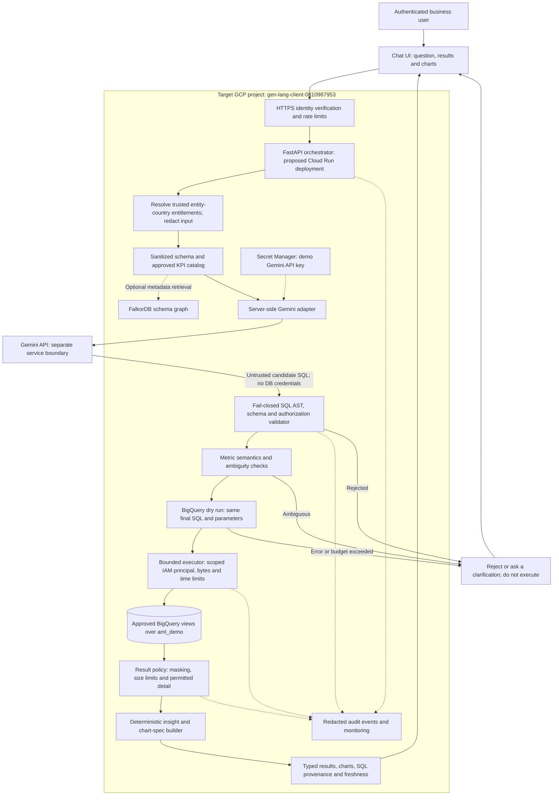

# Governed AML Analytics Architecture

Design and repository assessment: 2026-09-19. This document proposes the next architecture; it does not deploy services or certify banking compliance.

Implementation update: `analytics_service/` now provides an isolated six-KPI prototype, independent validation, a BigQuery adapter and an offline-tested dashboard. See [the service README](../analytics_service/README.md) and [verification report](../analytics_service/VERIFICATION.md). The inventory below records the original model-service baseline, not the new package. Live integration and cloud IAM/perimeter verification remain pending.

## Scope and Current Boundary

- Target: `gen-lang-client-0810987953.aml_demo`, documented dataset location `asia-south1`.
- Data is synthetic. Risk scores, explainability and model metadata are simulated, not actual AML AI model outputs.
- Seven entity-country scopes: `HASE_HK`, `HSBC_GB`, `HSBC_IN`, `HSBC_TW`, `HSBC_FR`, `HSBC_PL`, `HSBC_IE`.
- The reference image calls for governed self-service analytics, authorization and traceable results. BigQuery is the first data source; NoSQL expansion is not part of this phase.
- A project display name such as "Gemini API" does not establish a VPC Service Controls perimeter. Live IAM, billing, perimeter configuration and model endpoint residency were not verified during this architecture review.
- Repository and local dataset artifacts were inspected. Cloud deployment status must be checked separately before implementation.

## Target Diagram

All application components below are proposed unless identified as existing in the implementation inventory. The project box is an ownership boundary, NOT a claim of a configured security perimeter.

The API key authenticates the backend's model call only. BigQuery uses a separate IAM identity. No API key, service-account credential or raw model prompt is exposed to the browser. Results do not return to Gemini by default.

### Model Access Choices

**Synthetic demo:** server-side Gemini Developer API key, stored outside Git, preferably Secret Manager for a deployed service. Send only sanitized questions, approved schema metadata, permissible enum definitions and business rules. Disable unnecessary external grounding and tools. Do not send the full enriched dataset JSON: its examples and observed values can contain row-level information.

**Real banking data:** select an enterprise Google Cloud Gemini deployment with IAM-based workload authentication, approved endpoint/model/location and verified organization controls. Prefer an attached service account with Application Default Credentials over downloadable key files. Verify model-specific VPC Service Controls and residency support before drawing an enforced perimeter. A paid API key alone is not a data-residency guarantee. Google documents supported controls by model in its [security controls matrix](https://docs.cloud.google.com/vertex-ai/generative-ai/docs/security-controls).

Google's Gemini Developer API terms distinguish unpaid and paid processing. Unpaid service terms generally permit product improvement and human review and prohibit submitting sensitive information; there are EEA/UK/Switzerland exceptions. Paid processing has different protections but still describes limited abuse-monitoring retention and possible processing locations. Review the applicable terms before introducing confidential data. [Gemini API terms](https://ai.google.dev/gemini-api/terms)

## Request Processing Contract

1. Authenticate the user and resolve permissions on the server. Country names or prefixes in a prompt are not authorization. Reject excessive input and redact confidential identifiers before model access.
2. Retrieve metadata only for approved resources. Maintain one versioned catalog from `dataset/aml_data_model_schema.json`, recursively retaining nested fields, types and modes. Distinguish contractual `allowed_enum_values` from merely `observed_values`.
3. Request structured model output containing a candidate GoogleSQL query and typed parameters, or a clarification. Do not let the model submit jobs or choose execution credentials. Exemplar-based queries follow the same validation path.
4. Parse the entire query using a maintained BigQuery-dialect AST parser. Permit exactly one read-only query, including supported CTEs. Resolve all referenced resources and nested fields. Allowlist projects, datasets, views, columns and functions. Reject scripts, DDL, DML, `EXPORT DATA`, `CALL`, dynamic SQL, external queries, remote functions and unapproved routines. Parameterize user values; validate identifiers separately. Regex and a SELECT-only prompt are insufficient.
5. Validate business meaning and ambiguity. Read-only SQL can still disclose data or compute the wrong KPI. Do not silently fuzzy-repair an unknown banking metric into a different one. Any repair must pass every gate again; bound retries.
6. Dry-run the exact final SQL with its parameters, region and execution identity. Apply estimated-byte limits, then enforce `maximum_bytes_billed`, execution deadline, cancellation, concurrency limits and output pagination on the actual job. A dry run is not an authorization policy or an absolute cost guarantee; `LIMIT` alone does not limit bytes scanned. [BigQuery query execution](https://docs.cloud.google.com/bigquery/docs/running-queries)
7. Execute with least privilege: query job permission in the execution project and read access only to approved resources. No application Data Editor/Owner role. Provisioning/migration scripts and their write-capable credentials stay outside this request path.
8. Apply result disclosure rules, then produce typed tables and deterministic chart specifications. Return request ID, executed SQL or policy-approved representation, parameters with sensitive values redacted, job ID, data-as-of date, applied scope, units, truncation and synthetic-data status.
9. Record redacted operational audit events: identity, entitlement scope, schema/model version, SQL hash, validation decision, BigQuery job ID, bytes, latency and failures. Do not log API keys, full sensitive prompts or raw result rows. Restrict audit access and define retention.

### Country and Row-Level Isolation

BigQuery evaluates the execution principal, not the browser user's claimed identity. One broadly privileged service account does not automatically provide different user entitlements. For the first governed version, map trusted user entitlements to approved scope-specific views and execution principals with no base-table read access. Alternatively, design and verify delegated end-user identities with row policies. Multi-country users receive only their explicitly approved union of scopes. Apply column restrictions to PII and SAR-related detail as well as row filters. [BigQuery row-level security](https://docs.cloud.google.com/bigquery/docs/row-level-security-intro)

Cache keys must include entitlement scope, query parameters and schema version. Check ownership on result retrieval, cancellation and exports; an unguessable job ID is not authorization. Review small-group disclosure and export permissions under bank policy. Synthetic multi-country data in Mumbai does not establish approval to centralize real banking records there.

## Dashboard Builder

Implement a trusted Python module that converts typed results and approved KPI definitions into a constrained declarative chart specification. The browser renders the specification with a chart library; neither Python nor JavaScript produced by the LLM is executed.

| Result shape | Output |
| --- | --- |
| One approved scalar metric | KPI value, units and period |
| Time dimension plus numeric metric | Time-sorted line chart with explicit timezone |
| Category plus numeric metric | Bar chart with bounded categories and an explicit remainder policy |
| Multiple dimensions or detailed records | Paginated table; chart only when semantics are known |
| Empty, partial, suppressed or invalid result | Explicit state; no invented insight |

Insight text is calculated from actual result values: totals, changes and ranked categories with stated denominators. Avoid causal claims. Respect currency, decimal precision, nulls and missing time buckets. A chart must never silently represent a truncated result as the complete dataset. CSV/Excel exports, when added, require the same authorization and safe spreadsheet-cell handling.

Banking-specific metric definitions must establish Party historical-record joins, latest-versus-as-of risk scores, distinct cases versus case events, alert/SAR denominators and `units + nanos / 1e9` monetary interpretation. Do not mix normalized USD and local-currency companion amounts. "Latest" means latest available dataset period, not necessarily today's live position.

## Original Repository Baseline

| Component | Verified code/artifact | Gap to target |
| --- | --- | --- |
| Chat UI and HTTP API | `frontend/index.html`; `app.py` provides `/generate-sql`, `/health`, `/ui` | SQL preview only; no executed results or analytical charts |
| Schema retrieval | `pipeline/text2sql_falkordb.py`; `graph/build_falkordb_graph.py` | Graph builder still points to original `schema/aml_data_model_schema.json`; refresh from sanitized deployed schema |
| SQL generation | Local T5 with fine-tuned-directory fallback and exemplar retrieval | No Gemini client or server-side API-key integration |
| Validation and repair | `pipeline/schema_validator.py`: regex, fuzzy table/column correction, enum hints | Not a structural read-only, authorization or cost gate; `schema_valid` is not proof of safe execution |
| Validation response | `app.py` returns `schema_valid` and violations | Flags are returned to the caller, not a fail-closed execution decision |
| Schema documentation | `dataset/aml_data_model_schema.json`: deployed schema and value metadata | Runtime validator uses old schema and one-level `subfields`, not recursive deployed `fields` and explicit enum metadata |
| Dataset tooling | `dataset/` contains generator, loading/migration and validation artifacts | Provisioning is not a request-time BigQuery executor; do not reuse write-capable provisioning credentials |
| Access control | No user authentication/authorization in inspected API; wildcard CORS | Add identity, entitlement enforcement, least-privilege execution, restricted origins and rate limits |
| Operational safety | `/health` checks model presence; exceptions expose their text | Add dependency readiness, redacted errors, job budgets, cancellation and audit events |
| Evaluation | `eval/`, `training/`, `docs/TEST_REPORT.md` | Existing evaluations are not proof of intent accuracy, security or query-result correctness |

This is a source inspection, not a fresh application test run or cloud security audit. No production controls are inferred from documentation alone.

## Implementation Sequence

1. **Unify the schema and metrics.** Build the sanitized recursive catalog from the deployed JSON, refresh graph metadata, define KPI semantics and versioned GoogleSQL fixtures. Preserve original schema reference files.
2. **Build the security gate before execution.** Add identity and scope resolution, AST validation, function/resource allowlists, semantic checks, scoped BigQuery access and adversarial tests. Never rely on a model prompt to grant access.
3. **Add Gemini behind a provider interface.** Keep local T5 as an optional baseline. Add bounded requests, structured responses, secret handling and redacted telemetry. Compare held-out intent and result accuracy, not just exemplar matches.
4. **Implement the BigQuery execution adapter.** Dry runs, explicit `asia-south1`, parameter binding, bytes/deadline limits, cancellation and typed result pagination. Test a permitted aggregate end to end before enabling more query shapes.
5. **Add dashboard and API results.** Suggested contract: `POST /query` accepts a question and permitted filters; returns results or `202` with request ID. `GET /queries/{id}` and `GET /queries/{id}/results` enforce ownership; `POST /queries/{id}/cancel` cancels an owned job. Keep `/generate-sql` as a protected preview endpoint. Internally build charts from results, never arbitrary executable model code.
6. **Release only after checks pass.** Test prompt injection, unauthorized countries/columns, external/remote calls, multiple statements, nested SQL and CTE bypasses, high-cost scans, model timeouts, cross-user result access and cache leakage. Verify numerical results against gold queries, historical joins and currency handling. Record model/schema versions and regression results.

Deployment to Cloud Run, Secret Manager, enterprise model endpoints or additional storage may require billing and organization approval beyond BigQuery Sandbox. Select and approve those services separately; this design does not enable billing or provision infrastructure. Before real banking data, complete privacy, residency, retention, security and model-risk reviews, and verify deployed IAM and perimeter policies with negative-access tests.
